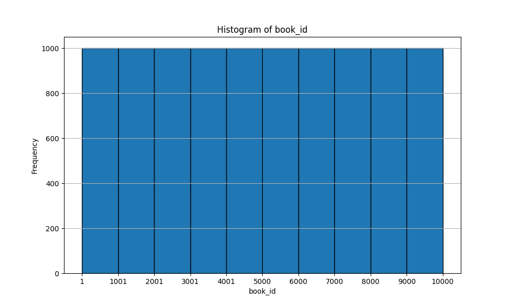
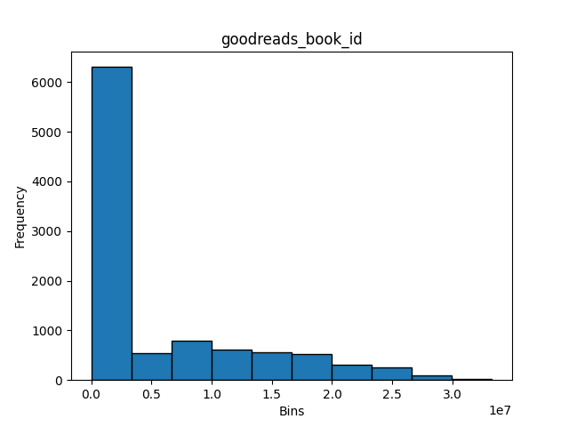
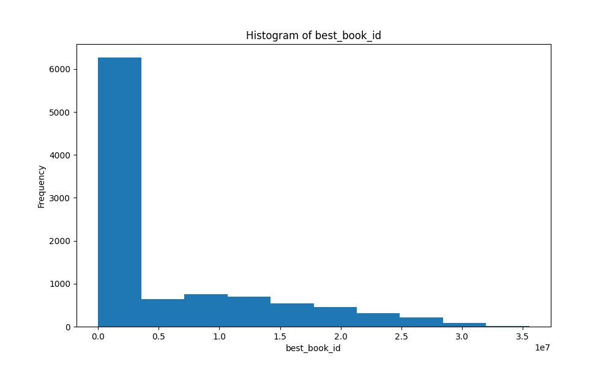

# Detailed Description of the Book Dataset

## Overview
The dataset contains information about 10,000 books, structured in 23 features that provide various attributes of each book, such as identifiers, authors, publication details, ratings, and images.

## Data Structure
- **Shape of Data**: The dataset consists of 10,000 rows and 23 columns.
- **Data Types**: The dataset features a mix of data types including integers (`int64`), floating-point numbers (`float64`), and strings (`object`).

### Data Types of Features
| Feature                          | Data Type  |
|----------------------------------|------------|
| book_id                          | int64      |
| goodreads_book_id                | int64      |
| best_book_id                     | int64      |
| work_id                          | int64      |
| books_count                      | int64      |
| isbn                             | object     |
| isbn13                           | float64    |
| authors                          | object     |
| original_publication_year        | float64    |
| original_title                   | object     |
| title                            | object     |
| language_code                    | object     |
| average_rating                   | float64    |
| ratings_count                    | int64      |
| work_ratings_count               | int64      |
| work_text_reviews_count          | int64      |
| ratings_1                        | int64      |
| ratings_2                        | int64      |
| ratings_3                        | int64      |
| ratings_4                        | int64      |
| ratings_5                        | int64      |
| image_url                        | object     |
| small_image_url                  | object     |

## Null Values
The dataset contains several features with null values:
- `isbn`: 700 null values
- `isbn13`: 585 null values
- `original_publication_year`: 21 null values
- `original_title`: 585 null values
- `language_code`: 1084 null values

All other features have no null values.

## Descriptive Statistics
### Numeric Features
The descriptive statistics for numeric features provide insights into the data distribution:

| Feature                        | Count         | Mean          | Std Dev       | Min      | 25th Percentile | Median  | 75th Percentile | Max          |
|--------------------------------|---------------|---------------|---------------|----------|------------------|---------|------------------|--------------|
| book_id                        | 10,000        | 5000.50       | 2886.90       | 1        | 2500.75          | 5000.50 | 7500.25          | 10,000       |
| goodreads_book_id              | 10,000        | 5,264,697     | 7,575,462     | 1        | 46,275.75        | 394,965 | 9,382,225        | 33,288,640   |
| best_book_id                   | 10,000        | 5,471,214     | 7,827,330     | 1        | 47,911.75        | 425,123 | 9,636,112        | 35,534,230   |
| work_id                        | 10,000        | 8,646,183     | 11,751,060    | 87       | 1,008,841        | 2,719,524 | 14,517,750      | 56,399,600   |
| books_count                    | 10,000        | 75.71         | 170.47        | 1        | 23               | 40      | 67               | 3,455        |
| isbn13                         | 9,415         | 9,755,044,000 | 442,861,900   | 195,170,300 | 9,780,316      | 9,780,452 | 9,780,831       | 9,790,008,000 |
| average_rating                 | 10,000        | 3.87          | 0.43          | 1        | 3.44             | 3.77    | 4.32             | 4.38         |
| ratings_count                  | 10,000        | 3,063.53      | 4,458.72      | 11       | 196              | 391     | 1,345            | 456,191      |
| work_ratings_count             | 10,000        | 9,800.00      | 12,000.00     | 30       | 656              | 1,163   | 3,110            | 793,319      |
| work_text_reviews_count        | 10,000        | 2,919.96      | 6,124.38      | 3        | 694              | 1,402   | 2,744            | 155,254      |
| ratings_1                      | 10,000        | 1,345.04      | 6,635.63      | 11       | 196              | 391     | 885              | 456,191      |
| ratings_2                      | 10,000        | 3,110.89      | 9,717.12      | 30       | 656              | 1,163   | 2,353            | 436,802      |
| ratings_3                      | 10,000        | 11,475.89     | 28,546.45     | 323      | 3,112            | 4,894   | 9,287            | 793,319      |
| ratings_4                      | 10,000        | 19,965.70     | 51,447.36     | 753      | 5,405            | 8,269   | 16,023           | 1,481,305    |
| ratings_5                      | 10,000        | 23,789.81     | 79,768.89     | 754      | 5,334            | 8,836   | 17,304           | 3,011,543    |

### Sample Data
The dataset provides various details such as book titles, authors, ratings, publication years, and images. Below are some samples:

| book_id | goodreads_book_id | authors             | original_publication_year | title                             | average_rating | ratings_count | image_url                                                  |
|---------|--------------------|---------------------|---------------------------|-----------------------------------|----------------|---------------|------------------------------------------------------------|
| 9356    | 1820716            | Daniel Glattauer    | 2006                      | Gut gegen Nordwind                | 3.88           | 6874          | https://s.gr-assets.com/assets/nophoto/book/111x148-bcc042a9c91a29c1d680899eff700a03.png |
| 3177    | 13834              | Tamora Pierce       | 1996                      | The Realms of the Gods           | 4.32           | 41233         | https://images.gr-assets.com/books/1262375414m/13834.jpg  |
| 9042    | 18310201           | Peter Heller        | 2014                      | The Painter                       | 3.76           | 8666          | https://images.gr-assets.com/books/1409595558m/18310201.jpg |
| 8314    | 18693753           | Elizabeth Little     | 2014                      | Dear Daughter                     | 3.44           | 10004         | https://images.gr-assets.com/books/1395618683m/18693753.jpg |
| 693     | 455373             | Michael Crichton    | 1987                      | Sphere                            | 3.77           | 128244        | https://s.gr-assets.com/assets/nophoto/book/111x148-bcc042a9c91a29c1d680899eff700a03.png |
| 2479    | 46945              | Hubert Selby Jr.    | 1978                      | Requiem for a Dream              | 4.10           | 37995         | https://images.gr-assets.com/books/1353949849m/46945.jpg   |

---

In conclusion, this dataset serves as a comprehensive repository of book-related data, suitable for analysis in various contexts such as recommendation systems, trends in literature, and more.

# Histogram of features: ['book_id', 'goodreads_book_id', 'best_book_id', 'work_id', 'books_count', 'isbn13', 'original_publication_year', 'average_rating', 'ratings_count', 'work_ratings_count', 'work_text_reviews_count', 'ratings_1', 'ratings_2', 'ratings_3', 'ratings_4', 'ratings_5']

Let us explore some of these features below

## Plot of feature: book_id

## Plot of feature: goodreads_book_id

## Plot of feature: best_book_id

