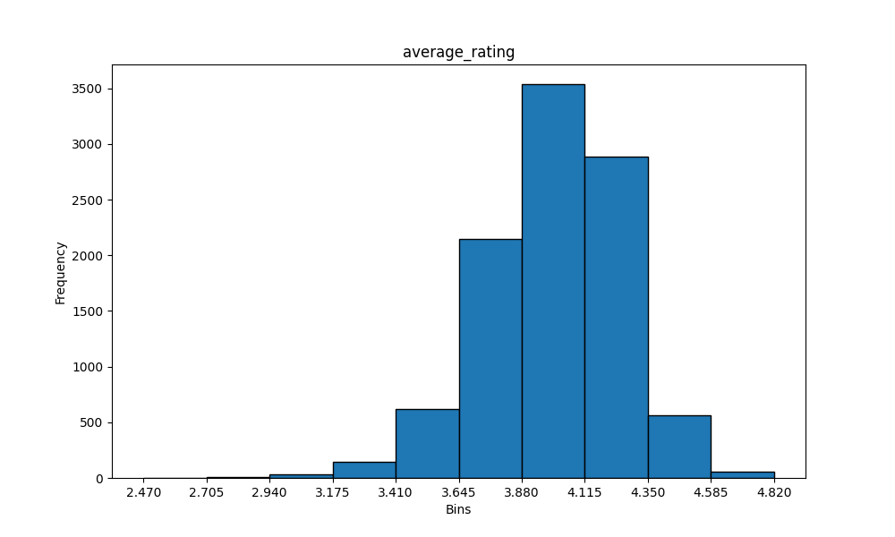
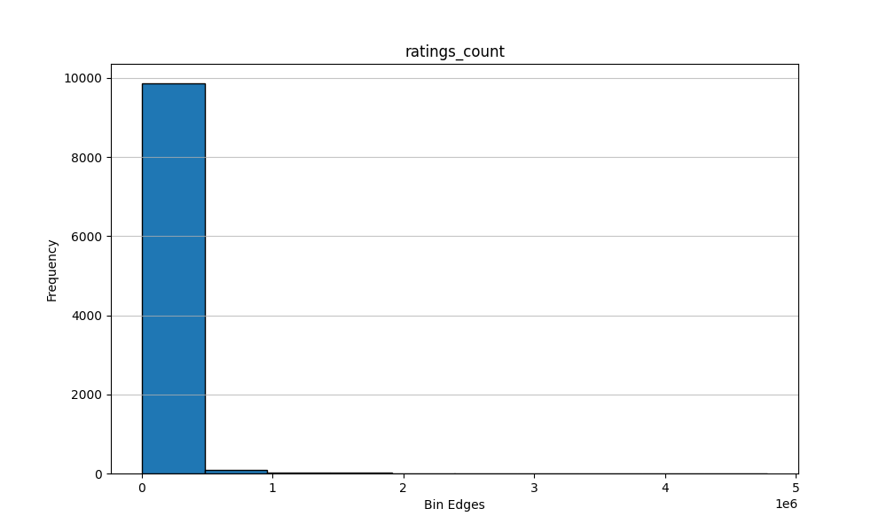

# Dataset Description

## Overview
The dataset consists of information about 10,000 books, including various attributes such as book IDs, authors, publication details, ratings, and images. This dataset can be useful for analyzing book popularity, author contributions, and reader preferences based on ratings and reviews.

## Shape of the Dataset
- **Total Rows**: 10,000
- **Total Columns**: 23

## Data Types of Features
The dataset includes the following features with their respective data types:

| Feature                        | Data Type   |
|-------------------------------|-------------|
| book_id                       | int64       |
| goodreads_book_id             | int64       |
| best_book_id                  | int64       |
| work_id                       | int64       |
| books_count                   | int64       |
| isbn                          | object      |
| isbn13                        | float64     |
| authors                       | object      |
| original_publication_year     | float64     |
| original_title                | object      |
| title                         | object      |
| language_code                 | object      |
| average_rating                | float64     |
| ratings_count                 | int64       |
| work_ratings_count            | int64       |
| work_text_reviews_count       | int64       |
| ratings_1                     | int64       |
| ratings_2                     | int64       |
| ratings_3                     | int64       |
| ratings_4                     | int64       |
| ratings_5                     | int64       |
| image_url                     | object      |
| small_image_url               | object      |

## Null Counts of Features
The following features contain null values:

| Feature                        | Null Count |
|-------------------------------|------------|
| isbn                          | 700        |
| isbn13                        | 585        |
| original_publication_year     | 21         |
| original_title                | 585        |
| language_code                 | 1084       |

## Descriptive Statistics of Numeric Features
The descriptive statistics for numeric features are summarized below:

| Statistic                     | book_id  | goodreads_book_id | best_book_id | work_id  | books_count | isbn13      | original_publication_year | average_rating | ratings_count | work_ratings_count | work_text_reviews_count | ratings_1 | ratings_2 | ratings_3 | ratings_4 | ratings_5 |
|-------------------------------|----------|--------------------|---------------|----------|--------------|-------------|--------------------------|----------------|---------------|---------------------|--------------------------|-----------|-----------|-----------|-----------|-----------|
| count                         | 10000.0  | 10000.0            | 10000.0       | 10000.0  | 10000.0      | 9415.0      | 9979.0                   | 10000.0        | 10000.0       | 10000.0             | 10000.0                 | 10000.0   | 10000.0   | 10000.0   | 10000.0   | 10000.0   |
| mean                          | 5000.5   | 5264697.0          | 5471214.0     | 8646183.0| 75.71        | 9.755044e+12| 2005.67                  | 4.15           | 578.23        | 2919.96             | 1345.04                 | 1345.04   | 3110.89   | 11475.89  | 19965.70  | 23789.81  |
| std                           | 2886.90  | 7575462.0          | 7827330.0     | 11751060.0| 170.47       | 4.428619e+11| 6.56                     | 0.98           | 6635.63       | 6124.38             | 6635.63                 | 6635.63   | 9717.12   | 28546.44  | 51447.36  | 79768.89  |
| min                           | 1.0      | 1.0                | 1.0           | 870.0    | 1.0          | 1.951703e+08| 1999.0                   | 1.0            | 11.0          | 3.0                 | 3.0                     | 11.0      | 30.0      | 323.0     | 750.0     | 754.0     |
| 25%                           | 2500.75  | 462757.0           | 479117.0      | 1008841.0| 23.0         | 9.780316e+12| 2002.0                   | 3.0            | 196.0         | 694.0               | 196.0                   | 196.0     | 656.0     | 3112.0    | 5405.75   | 5334.0    |
| 50%                           | 5000.5   | 394965.0           | 425123.0      | 2719524.0| 40.0         | 9.780452e+12| 2005.0                   | 4.0            | 391.0         | 1402.0              | 391.0                   | 391.0     | 1163.0    | 4894.0    | 8269.5    | 8836.0    |
| 75%                           | 7500.25  | 9382225.0          | 9636112.0     | 14517750.0| 67.0         | 9.780831e+12| 2009.0                   | 5.0            | 885.0         | 2744.25            | 885.0                   | 885.0     | 2353.25    | 9287.0    | 16023.5   | 17304.5   |
| max                           | 10000.0  | 33288640.0         | 35534230.0    | 56399600.0| 3455.0       | 9.790008e+12| 2018.0                   | 5.0            | 456191.0      | 155254.0           | 155254.0               | 456191.0  | 436802.0  | 793319.0  | 1481305.0 | 3011543.0  |

## Sample Data
The following are ten samples from the dataset:

|      |   book_id |   goodreads_book_id |   best_book_id |   work_id |   books_count | isbn       |        isbn13 | authors                                 |   original_publication_year | original_title                      | title                                          | language_code   |   average_rating |   ratings_count |   work_ratings_count |   work_text_reviews_count |   ratings_1 |   ratings_2 |   ratings_3 |   ratings_4 |   ratings_5 | image_url                                                                                | small_image_url                                                                        |
|-----:|----------:|--------------------:|---------------:|----------:|--------------:|:-----------|--------------:|:----------------------------------------|----------------------------:|:------------------------------------|:-----------------------------------------------|:----------------|-----------------:|----------------:|---------------------:|--------------------------:|------------:|------------:|------------:|------------:|------------:|:-----------------------------------------------------------------------------------------|:---------------------------------------------------------------------------------------|
| 1505 |      1506 |                1427 |           1427 |   3341790 |           154 | 60832819   |   9.78006e+12 | Paulo Coelho, Margaret Jull Costa       |                        2005 | O Zahir                             | The Zahir                                      | eng             |             3.56 |           50921 |                56047 |                      2731 |        2677 |        6561 |       16568 |       16990 |       13251 | https://images.gr-assets.com/books/1493044059m/1427.jpg                                  | https://images.gr-assets.com/books/1493044059s/1427.jpg                                |
| 4760 |      4761 |            13416236 |       13416236 |  18731533 |            19 | 1250011914 |   9.78125e+12 | C.C. Hunter                             |                        2012 | Whispers at Moonrise                | Whispers at Moonrise (Shadow Falls, #4)        | eng             |             4.38 |           28430 |                29922 |                      1339 |         212 |         657 |        3437 |        8916 |       16700 | https://images.gr-assets.com/books/1331497103m/13416236.jpg                              | https://images.gr-assets.com/books/1331497103s/13416236.jpg                            |
| 1094 |      1095 |              213753 |         213753 |    206925 |            32 | 152061548  | nan           | Susan Beth Pfeffer                      |                        2006 | Life As We Knew It                  | Life As We Knew It (Last Survivors, #1)        | eng             |             3.89 |           94282 |                98669 |                      8461 |        3105 |        6799 |       21733 |       33458 |       33574 | https://images.gr-assets.com/books/1328012816m/213753.jpg                                | https://images.gr-assets.com/books/1328012816s/213753.jpg                              |
|  458 |       459 |            18774964 |       18774964 |  21619954 |           132 | 1476738017 |   9.78148e+12 | Fredrik Backman, Henning Koch           |                        2012 | En man som heter Ove                | A Man Called Ove                               | eng             |             4.35 |          183777 |               243440 |                     34386 |        2589 |        5734 |       25138 |       81377 |      128602 | https://images.gr-assets.com/books/1405259930m/18774964.jpg                              | https://images.gr-assets.com/books/1405259930s/18774964.jpg                            |
| 1072 |      1073 |                5797 |           5797 |   1057468 |           650 | 141439831  |   9.78014e+12 | William Makepeace Thackeray, John Carey |                        1847 | Vanity Fair: A Novel Without a Hero | Vanity Fair                                    | eng             |             3.76 |           91323 |                97978 |                      2598 |        3050 |        8007 |       25897 |       33250 |       27774 | https://images.gr-assets.com/books/1344386439m/5797.jpg                                  | https://images.gr-assets.com/books/1344386439s/5797.jpg                                |
|  345 |       346 |              236093 |         236093 |   1993810 |          1474 | 140621679  |   9.78014e+12 | L. Frank Baum, W.W. Denslow             |                        1900 | The Wonderful Wizard of Oz          | The Wonderful Wizard of Oz (Oz, #1)            | eng             |             3.98 |          247521 |               279400 |                      8866 |        4197 |       13653 |       65910 |       95948 |       99692 | https://images.gr-assets.com/books/1398003737m/236093.jpg                                | https://images.gr-assets.com/books/1398003737s/236093.jpg                              |
| 8677 |      8678 |            15723286 |       15723286 |  21398040 |            26 | nan        | nan           | Gail Carriger                           |                        2013 | Curtsies & Conspiracies             | Curtsies & Conspiracies (Finishing School, #2) | eng             |             4.11 |           15078 |                18011 |                      2041 |          91 |         355 |        3220 |        8081 |        6264 | https://images.gr-assets.com/books/1359660588m/15723286.jpg                              | https://images.gr-assets.com/books/1359660588s/15723286.jpg                            |
| 2975 |      2976 |               91248 |          91248 |    632895 |            55 | 192751077  |   9.78019e+12 | Beverly Cleary, Alan Tiegreen           |                        1975 | Ramona the Brave                    | Ramona the Brave (Ramona, #3)                  | eng             |             4.09 |           42479 |                44092 |                       558 |         665 |        1536 |        9090 |       14624 |       18177 | https://images.gr-assets.com/books/1408925322m/91248.jpg                                 | https://images.gr-assets.com/books/1408925322s/91248.jpg                               |
| 8056 |      8057 |              140345 |         140345 |   1507078 |            39 | 6499473    |   9.78001e+12 | Mary Westmacott, Agatha Christie        |                        1944 | Absent in the Spring                | Absent In The Spring                           | eng             |             4.14 |            9787 |                 9971 |                       191 |         131 |         393 |        1955 |        2915 |        4577 | https://images.gr-assets.com/books/1396225976m/140345.jpg                                | https://images.gr-assets.com/books/1396225976s/140345.jpg                              |
| 2424 |      2425 |               49195 |          49195 |    775862 |            50 | 140003003X |   9.7814e+12  | Bill Clinton                            |                        2004 | My Life                             | My Life                                        | eng             |             3.72 |           35852 |                37311 |                      1049 |        1455 |        2819 |       10284 |       12894 |        9859 | https://s.gr-assets.com/assets/nophoto/book/111x148-bcc042a9c91a29c1d680899eff700a03.png | https://s.gr-assets.com/assets/nophoto/book/50x75-a91bf249278a81aabab721ef782c4a74.png |

# Histogram of features: ['isbn13', 'original_publication_year', 'average_rating', 'ratings_count', 'work_ratings_count', 'work_text_reviews_count', 'ratings_1', 'ratings_2', 'ratings_3', 'ratings_4', 'ratings_5']

Let us explore some features below

## Plot of feature: average_rating

## Plot of feature: ratings_count

## Plot of feature: work_ratings_count

