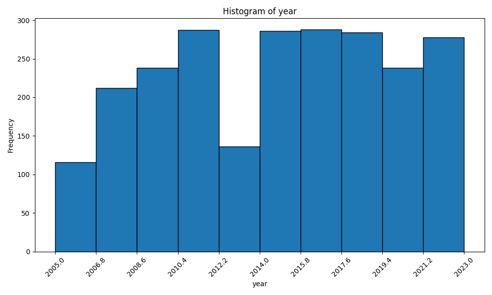
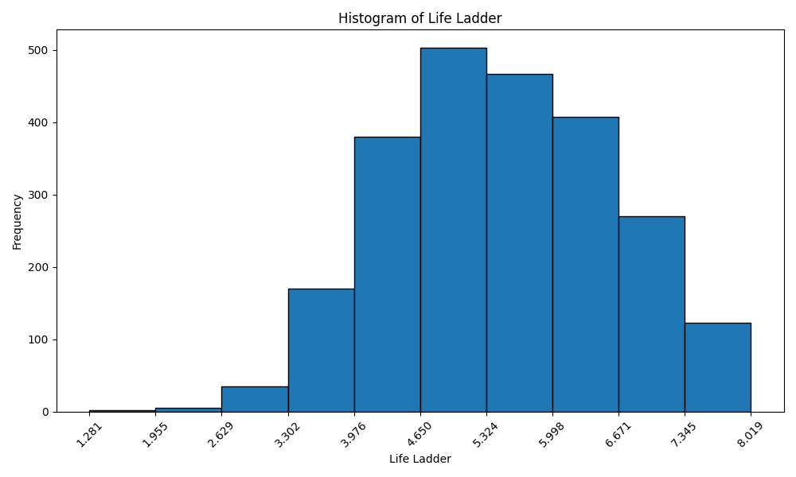

# Dataset Description

## Overview
The dataset consists of 2363 samples with 11 features related to various countries. The data encompasses life quality indicators such as life satisfaction, economic metrics, social support, and perceptions of corruption over multiple years.

## Shape of the Data
- **Number of Rows (Samples)**: 2363
- **Number of Columns (Features)**: 11

## Data Types of Features
| Feature Name                                    | Data Type |
|------------------------------------------------|-----------|
| Country name                                   | object    |
| year                                           | int64     |
| Life Ladder                                    | float64   |
| Log GDP per capita                             | float64   |
| Social support                                  | float64   |
| Healthy life expectancy at birth               | float64   |
| Freedom to make life choices                   | float64   |
| Generosity                                     | float64   |
| Perceptions of corruption                       | float64   |
| Positive affect                                | float64   |
| Negative affect                                | float64   |

## Null Counts of Features
| Feature Name                                    | Null Count |
|------------------------------------------------|------------|
| Country name                                   | 0          |
| year                                           | 0          |
| Life Ladder                                    | 0          |
| Log GDP per capita                             | 28         |
| Social support                                  | 13         |
| Healthy life expectancy at birth               | 63         |
| Freedom to make life choices                   | 36         |
| Generosity                                     | 81         |
| Perceptions of corruption                       | 125        |
| Positive affect                                | 24         |
| Negative affect                                | 16         |

## Descriptive Statistics of Numeric Features
| Feature                                      | Count    | Mean       | Std Dev   | Min      | 25%      | 50%      | 75%      | Max      |
|----------------------------------------------|----------|------------|-----------|----------|----------|----------|----------|----------|
| year                                         | 2363     | 2014.76    | 5.06      | 2005     | 2011     | 2015     | 2019     | 2023     |
| Life Ladder                                  | 2363     | 5.48       | 1.13      | 1.28     | 4.65     | 5.45     | 6.32     | 8.02     |
| Log GDP per capita                           | 2335     | 9.40       | 1.15      | 5.53     | 8.51     | 9.50     | 10.39    | 11.68    |
| Social support                                | 2350     | 0.81       | 0.12      | 0.23     | 0.74     | 0.83     | 0.90     | 0.99     |
| Healthy life expectancy at birth             | 2300     | 63.40      | 6.84      | 6.72     | 59.20    | 65.10    | 68.55    | 74.60    |
| Freedom to make life choices                 | 2327     | 0.75       | 0.14      | 0.23     | 0.66     | 0.77     | 0.86     | 0.99     |
| Generosity                                   | 2282     | 0.00       | 0.16      | -0.34    | -0.11    | -0.02    | 0.09     | 0.70     |
| Perceptions of corruption                     | 2238     | 0.74       | 0.18      | 0.04     | 0.69     | 0.80     | 0.87     | 0.98     |
| Positive affect                              | 2339     | 0.65       | 0.11      | 0.18     | 0.57     | 0.80     | 0.74     | 0.88     |
| Negative affect                              | 2347     | 0.27       | 0.09      | 0.08     | 0.21     | 0.26     | 0.33     | 0.71     |

## Sample Data
Here are ten samples from the dataset:

|      | Country name   |   year |   Life Ladder |   Log GDP per capita |   Social support |   Healthy life expectancy at birth |   Freedom to make life choices |   Generosity |   Perceptions of corruption |   Positive affect |   Negative affect |
|-----:|:---------------|-------:|--------------:|---------------------:|-----------------:|-----------------------------------:|-------------------------------:|-------------:|----------------------------:|------------------:|------------------:|
|  326 | Cambodia       |   2019 |         4.998 |                8.404 |            0.759 |                             61.5   |                          0.957 |        0.007 |                       0.828 |             0.704 |             0.39  |
|  289 | Bulgaria       |   2021 |         5.422 |               10.102 |            0.884 |                             66.5   |                          0.841 |       -0.018 |                       0.891 |             0.647 |             0.253 |
| 1635 | Paraguay       |   2010 |         5.841 |                9.331 |            0.889 |                             65.2   |                          0.726 |        0.065 |                       0.78  |             0.826 |             0.176 |
| 2343 | Zambia         |   2022 |         3.728 |                8.101 |            0.717 |                             55.675 |                          0.889 |       -0.009 |                       0.716 |             0.66  |             0.309 |
|  914 | Indonesia      |   2015 |         5.043 |                9.222 |            0.809 |                             62.3   |                          0.779 |        0.466 |                       0.946 |             0.796 |             0.274 |
| 1758 | Rwanda         |   2008 |         4.363 |                7.213 |            0.486 |                             54.7   |                          0.752 |        0.014 |                       0.286 |             0.633 |             0.221 |
| 1981 | Sudan          |   2009 |         4.455 |                8.457 |            0.911 |                             57.46  |                          0.71  |        0.046 |                       0.701 |             0.688 |             0.245 |
| 1531 | Nicaragua      |   2021 |         6.095 |                8.647 |            0.848 |                             65.65  |                          0.905 |        0.02  |                       0.675 |             0.799 |             0.293 |
|   26 | Albania        |   2019 |         4.995 |                9.522 |            0.686 |                             69.1   |                          0.777 |       -0.103 |                       0.914 |             0.548 |             0.274 |
| 1226 | Lithuania      |   2013 |         5.596 |               10.261 |            0.913 |                             64.9   |                          0.556 |       -0.242 |                       0.936 |             0.54  |             0.294 |

# Histogram of features: ['year', 'Life Ladder', 'Log GDP per capita', 'Social support', 'Healthy life expectancy at birth', 'Freedom to make life choices', 'Generosity', 'Perceptions of corruption', 'Positive affect', 'Negative affect']

Let us explore some features below

## Plot of feature: year

## Plot of feature: Life Ladder

