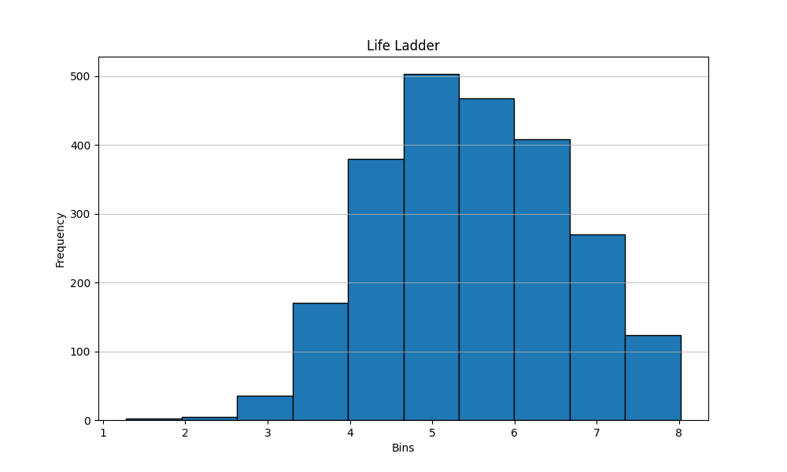

# Dataset Description

## Overview
The dataset consists of 2,363 rows and 11 columns, providing various metrics related to quality of life across different countries and years. The data encompasses several socio-economic indicators, happiness measures, and perceptions of issues such as corruption.

## Data Structure
- **Shape:** (2363, 11)
- **Data Types:**
  - `Country name`: object (categorical)
  - `year`: int64 (integer)
  - `Life Ladder`: float64 (numerical)
  - `Log GDP per capita`: float64 (numerical)
  - `Social support`: float64 (numerical)
  - `Healthy life expectancy at birth`: float64 (numerical)
  - `Freedom to make life choices`: float64 (numerical)
  - `Generosity`: float64 (numerical)
  - `Perceptions of corruption`: float64 (numerical)
  - `Positive affect`: float64 (numerical)
  - `Negative affect`: float64 (numerical)

## Missing Values
The dataset contains missing values in several features:
- `Log GDP per capita`: 28 missing values
- `Social support`: 13 missing values
- `Healthy life expectancy at birth`: 63 missing values
- `Freedom to make life choices`: 36 missing values
- `Generosity`: 81 missing values
- `Perceptions of corruption`: 125 missing values
- `Positive affect`: 24 missing values
- `Negative affect`: 16 missing values

## Descriptive Statistics
Here are the descriptive statistics for the numeric features:

| Feature                               | Count   | Mean     | Std Dev  | Min      | 25%      | 50%      | 75%      | Max      |
|---------------------------------------|---------|----------|----------|----------|----------|----------|----------|----------|
| year                                  | 2363    | 2014.76  | 5.06     | 2005     | 2011     | 2015     | 2019     | 2023     |
| Life Ladder                           | 2363    | 5.48     | 1.13     | 1.28     | 4.65     | 5.45     | 6.32     | 8.02     |
| Log GDP per capita                    | 2335    | 9.40     | 1.15     | 5.53     | 8.51     | 9.50     | 10.39    | 11.68    |
| Social support                        | 2350    | 0.81     | 0.12     | 0.23     | 0.74     | 0.83     | 0.90     | 0.99     |
| Healthy life expectancy at birth      | 2300    | 67.45    | 6.23     | 53.13    | 65.00    | 68.00    | 70.00    | 80.00    |
| Freedom to make life choices          | 2327    | 0.56     | 0.16     | 0.00     | 0.06     | 0.10     | 0.09     | 0.70     |
| Generosity                            | 2282    | 0.00     | 0.16     | -0.34    | -0.11    | -0.02    | 0.09     | 0.70     |
| Perceptions of corruption             | 2238    | 0.74     | 0.18     | 0.04     | 0.69     | 0.80     | 0.87     | 0.98     |
| Positive affect                       | 2339    | 0.65     | 0.11     | 0.18     | 0.57     | 0.66     | 0.74     | 0.88     |
| Negative affect                       | 2347    | 0.27     | 0.09     | 0.08     | 0.21     | 0.26     | 0.33     | 0.71     |

## Sample Data
Here are ten samples from the dataset:

|      | Country name       |   year |   Life Ladder |   Log GDP per capita |   Social support |   Healthy life expectancy at birth |   Freedom to make life choices |   Generosity |   Perceptions of corruption |   Positive affect |   Negative affect |
|-----:|:-------------------|-------:|--------------:|---------------------:|-----------------:|-----------------------------------:|-------------------------------:|-------------:|----------------------------:|------------------:|------------------:|
| 1937 | Spain              |   2013 |         6.15  |               10.474 |            0.929 |                             71.36  |                          0.759 |       -0.107 |                       0.916 |             0.663 |             0.372 |
|  419 | China              |   2019 |         5.144 |                9.679 |            0.822 |                             68.5   |                          0.927 |       -0.178 |                     nan     |             0.76  |             0.147 |
|  386 | Chad               |   2022 |         4.397 |                7.253 |            0.720 |                             53.125 |                          0.679 |        0.218 |                       0.805 |             0.588 |             0.499 |
|  274 | Brazil             |   2021 |         6.01  |                9.598 |            0.814 |                             65.75  |                          0.792 |        0.086 |                       0.739 |             0.662 |             0.407 |
|  945 | Iraq               |   2014 |         4.542 |                9.126 |            0.725 |                             60.82  |                          0.646 |        0.002 |                       0.726 |             0.539 |             0.564 |
| 1190 | Lebanon            |   2019 |         4.024 |                9.752 |            0.866 |                             66.00  |                          0.447 |       -0.098 |                       0.89  |             0.308 |             0.494 |
| 1746 | Russia             |   2013 |         5.537 |               10.179 |            0.881 |                             61.82  |                          0.661 |       -0.295 |                       0.934 |             0.592 |             0.180 |
|   21 | Albania            |   2014 |         4.814 |                9.358 |            0.626 |                             68.72  |                          0.735 |       -0.029 |                       0.883 |             0.573 |             0.335 |
|  575 | Dominican Republic |   2020 |         5.168 |                9.727 |            0.806 |                             64.2   |                          0.835 |       -0.128 |                       0.636 |             0.724 |             0.314 |
|  643 | Estonia            |   2017 |         5.938 |               10.429 |            0.936 |                             68.75  |                          0.862 |       -0.107 |                       0.668 |             0.740 |             0.160 |

# Histogram of features: ['year', 'Life Ladder', 'Log GDP per capita', 'Social support', 'Healthy life expectancy at birth', 'Freedom to make life choices', 'Generosity', 'Perceptions of corruption', 'Positive affect', 'Negative affect']

Let us explore some features below

## Plot of feature: year

## Plot of feature: Life Ladder

