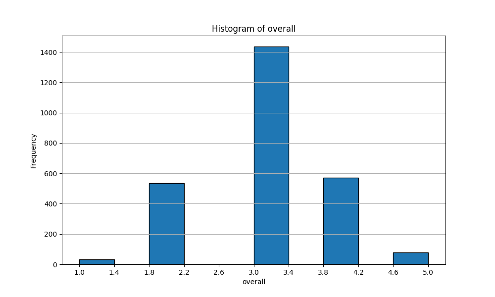
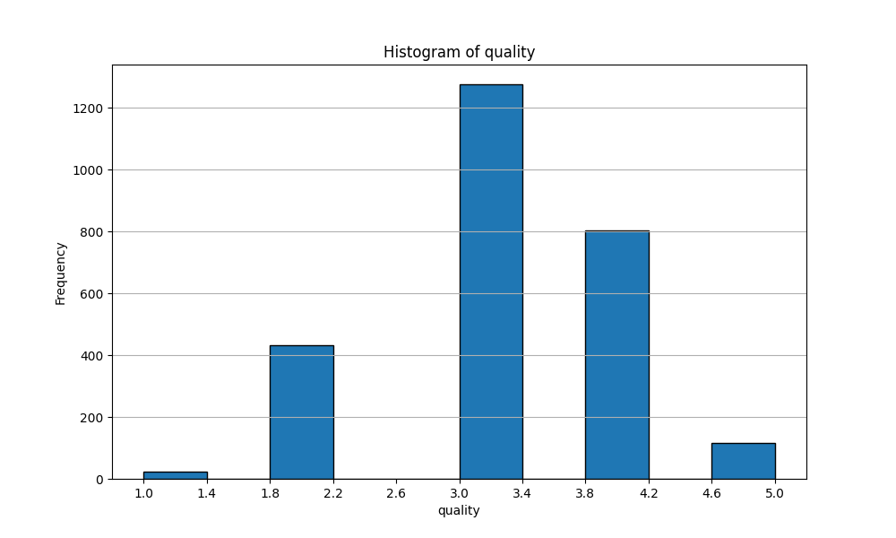
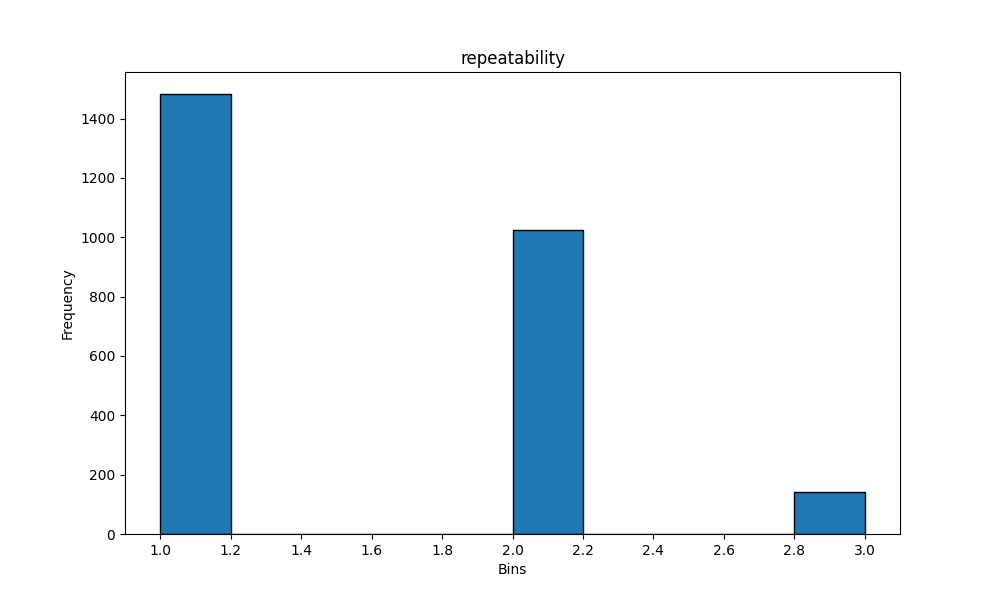

```
# Dataset Overview

The dataset consists of 2,652 entries across 8 features. It appears to be a collection of reviews or ratings related to movies and other types of media, with various attributes captured for each entry.

## Shape of Data

- **Total Entries (Rows)**: 2652
- **Total Features (Columns)**: 8

## Data Types of Features

The dataset contains a mix of object and integer data types:

| Feature        | Data Type |
|----------------|-----------|
| date           | object    |
| language       | object    |
| type           | object    |
| title          | object    |
| by             | object    |
| overall        | int64     |
| quality        | int64     |
| repeatability   | int64     |

## Null Counts of Features

The dataset has some missing values, particularly in the `date` and `by` columns:

| Feature        | Null Count |
|----------------|------------|
| date           | 99         |
| language       | 0          |
| type           | 0          |
| title          | 0          |
| by             | 262        |
| overall        | 0          |
| quality        | 0          |
| repeatability   | 0          |

## Descriptive Statistics of Numeric Features

The numeric features `overall`, `quality`, and `repeatability` are summarized below:

| Statistic      | overall  | quality  | repeatability |
|----------------|----------|----------|---------------|
| count          | 2652.00  | 2652.00  | 2652.00       |
| mean           | 3.05     | 3.21     | 1.49          |
| std            | 0.76     | 0.80     | 0.60          |
| min            | 1.00     | 1.00     | 1.00          |
| 25%            | 3.00     | 3.00     | 1.00          |
| 50%            | 3.00     | 3.00     | 1.00          |
| 75%            | 3.00     | 4.00     | 2.00          |
| max            | 5.00     | 5.00     | 3.00          |

## Sample Data

Below are ten samples from the dataset:

|      | date      | language   | type    | title                  | by                                |   overall |   quality |   repeatability |
|-----:|:----------|:-----------|:--------|:-----------------------|:----------------------------------|----------:|----------:|----------------:|
| 2179 | 17-Oct-06 | English    | movie   | Spy Game               | Robert Redford, Brad Pitt         |         3 |         3 |               1 |
|   52 | 04-Jan-24 | English    | movie   | Threat Level Midnight  | Steve Carell                      |         3 |         3 |               1 |
|  456 | 08-May-20 | English    | fiction | Shadow's Edge          | Brent Weeks                       |         2 |         3 |               1 |
|  279 | 27-Feb-22 | Tamil      | movie   | Mahaan                 | Vikram, Bobby Simha, Dhruv Vikram |         3 |         4 |               1 |
| 2139 | 17-Nov-06 | English    | movie   | Fargo                  | William Macy, Steve Buscemi       |         3 |         3 |               1 |
| 2575 | nan       | English    | movie   | Citizen Kane           | nan                               |         4 |         4 |               1 |
|  892 | 11-Dec-17 | English    | movie   | Spiderman:  Homecoming | Tom Holland                       |         3 |         4 |               2 |
| 1134 | 29-Jan-15 | Hindi      | movie   | Baby                   | Akshay Kumar                      |         3 |         4 |               2 |
|   95 | 18-Jun-23 | English    | movie   | The Proposal           | Ryan Reynolds, Sandra Bullock     |         2 |         2 |               1 |
| 1342 | 23-May-13 | English    | movie   | The Pink Panther 2     | Steve Martin, Aishwarya Rai       |         3 |         3 |               2 |
```

# Histogram of features: ['overall', 'quality', 'repeatability']

Let us explore some features below


## Plot of feature: overall




## Plot of feature: quality




## Plot of feature: repeatability



